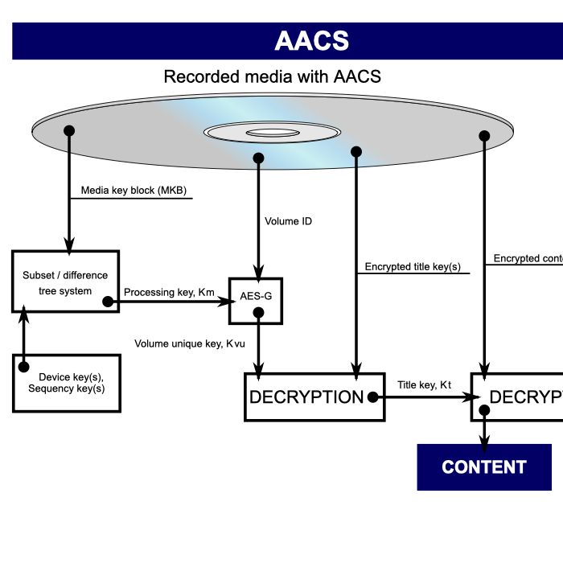
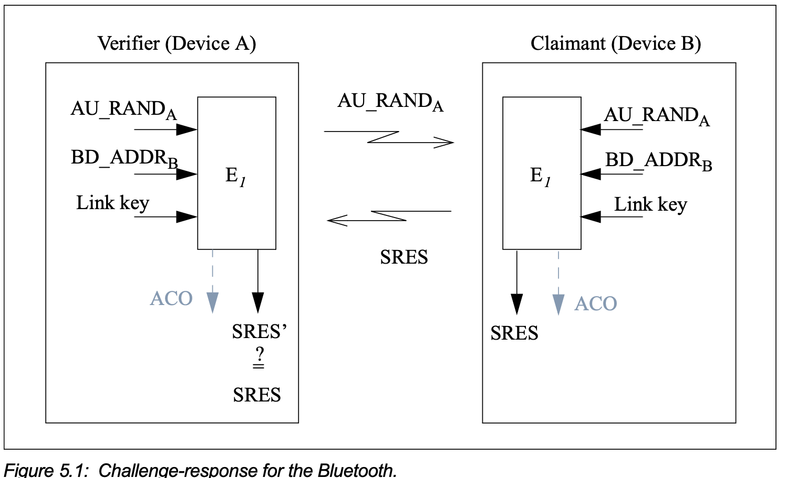

# Q1 - 12.19

Cryptography can be used in many different ways to support digital rights management. Find out hwo Blu-ray technology uses cryptography to protect the content on its discs.

## Research

Blu-Ray discs contained encrypted content, a _Media Key Block_, a _Volume ID_ and one or more encrypted _Title Keys_. The Blu-Ray player that you would have bought, as a consumer, had within it a _Device Key_. Together, the _Media Key Block_ and the _Device Key_ where used to create the _Media Key_ which was then used, in conjunction with the _Volume ID_ to decrypt one of the _Title Keys_ which was ultimately used to decrypt the content on the disc.

Similar to the need to revoke fraudulent of compromised certificates, there was a need to be able to revoke certain keys in the Blu-Ray system. Therefore, the MKB contains an HRL (_Host Revocation List_) for software players and a DRL (_Device Revocation List_) for hardware players.

This system is known as AACS - Advanced Access Content System. AACS defaults to using AES as the encryption process.

Here is a flow image of the process:



## Sources

- https://www.anandtech.com/show/5693/cinavia-drm-how-i-learned-to-stop-worrying-and-love-blurays-selfdestruction/2
- https://en.wikipedia.org/wiki/Advanced_Access_Content_System

# Q2 - 13.3

File Encryption is supported by many operation systems and third party software applications. Select an example of a file encryption mechanism and explain:

I've chosen the most common file encryption method used in Linux: GnuPG, which is an implementation of OpenPGP.

- which encryption algorithms are supported

```
Supported algorithms:
Pubkey: RSA, ELG, DSA, ECDH, ECDSA, EDDSA
Cipher: IDEA, 3DES, CAST5, BLOWFISH, AES, AES192, AES256, TWOFISH,
        CAMELLIA128, CAMELLIA192, CAMELLIA256
AEAD: EAX, OCB
Hash: SHA1, RIPEMD160, SHA256, SHA384, SHA512, SHA224
Compression: Uncompressed, ZIP, ZLIB, BZIP2
```

- how keys are generated
  - Keys are generated using the structure for whichever algorithm is requested to use for the keypair, and using local entropy from the machine.

```
We need to generate a lot of random bytes. It is a good idea to perform
some other action (type on the keyboard, move the mouse, utilize the
disks) during the prime generation; this gives the random number
generator a better chance to gain enough entropy.
We need to generate a lot of random bytes. It is a good idea to perform
some other action (type on the keyboard, move the mouse, utilize the
disks) during the prime generation; this gives the random number
generator a better chance to gain enough entropy.
gpg: /Users/benjcape/.gnupg/trustdb.gpg: trustdb created
gpg: directory '/Users/benjcape/.gnupg/openpgp-revocs.d' created
gpg: revocation certificate stored as '/Users/benjcape/.gnupg/openpgp-revocs.d/4B75FCE1C9BC896DC3D9
D7356BDE1C738ED9355C.rev'
public and secret key created and signed.

pub   ed25519 2022-08-05 [SC] [expires: 2024-08-04]
      4B75FCE1C9BC896DC3D9D7356BDE1C738ED9355C
uid                      peten <benjcape@gmail.com>
sub   cv25519 2022-08-05 [E] [expires: 2024-08-04]
```

As you can see when it generates a key it also created a revocation list to keep track of revoked keys. They keys also have a Real Name, Email and Passcode associated with them.

- where the user's decryption keys are stored
  - Decryption keys are stored locally at `~/.gnupg/private-keys-v1.d`
- how a user accesses an encrypted file
  - After encrypting using `gpg -e -r peten ./Documents/IMG_1606.jpg`
  - We find the new file (encrypted) at `./Documents/IMG_1606.jpg.gpg`
  - Since we encrypted it for peten (we used peten's public key)
  - We can then decrypt using `gpg -d -o ./IMG_out.jpg -u peten ./IMG_1606.jpg.gpg`
  - We are then prompted with a window to enter our passphrase.
  - We enter it and we get the file back!
- what mechanisms exist to support a user who has lost a decryption key (or forgotten how to activate it)
  - As mentioned previously, there are revocation lists. The user could easily revoke the public key (because if they lost of passphrase, everything encrypted with that matching public key is useless, or potentially stolen since someone else might have the private key).
  - You can upload your revocation certificate to a keyserver:
    - https://medium.com/@fro_g/oh-no-i-forgot-my-pgp-private-keys-passphrase-6ec1d0228b48

# Q3 - 13.9

Explain how iOS uses cryptography to:

- prevent a malicious app from being installed on the device
  - Apple's root CA is preinstalled on all devices, and is used to sign signatures that will be used to sign apps. Only verified developers, who have been granted certificates can sign apps that can be verified with Apple's root CA, and therefore be permitted onto a device. In short, iOS requires that all code be signed and verified through Apple's root CA before it can run on the device.
- protect data on the device in the event the device is stolen
  - The class key, a core component of decrypting any file (since all files are part of a class), is derived from the UID of the file, and from the passcode of the device. Therefore, even if the device is stolen, since one does not know the passcode, they cannot derive the class keys. Therefore they cannot decrypt any of the files that have a class. Apple has said that the process for deriving the class key given the passcode is extremely hard to crack.
- frustrate attempts to engage in surveillance of communications using the device.
  - Apple utilizes simple public key cryptography, and acts as a key storage center itself to distribute public keys based on identity information to users.

# Q4 - 13.12

One networking service supported by many personal devices applications is Bluetooth, which allows short-range wireless communication between two Bluetooth-enabled devices. Investigate the extent to which cryptography is used to provide security for the different versions of Bluetooth, including both the cryptographic services and the key management services.

The first component of the cryptographic methods of Bluetooth involved device pairing, which is, in accordance with our cryptographic primitives identity authentication.

Some of the methods for pairing in Bluetooth 4.0 include but are not limited to:

- Just Works: The fastest but less secure method of passing encryption keys for both devices
- OOB (Out of Band): Uses other authentication methods (besides Bluetooth) to send encryption keys. An example would include connecting through NFC or using your device's camera to scan a QR code on the other device's display
- Passkey: Users authenticate themselves by giving the correct passkey when prompted
- Numeric Comparison: Works just like Passkey, but the devices automatically send passkeys. The users only need to confirm if both devices have the same passkeys

The next component is key exchange. Bluetooth 4.0 supports symmetric and asymmetric cryptography, and uses AES and ECC respectively.

I know this isn't really used anymore, but with bluetooth there is always a master and a slave. The master scans for broadcasting devices, and the slave broadcasts it's location so it can be connected to.

Source

- https://www.makeuseof.com/what-is-bluetooth-encryption-how-does-it-work/

Bluetooth also supports signing signing data:

Bluetooth LE supports the ability to send authenticated data over an unen- crypted ATT bearer between two devices with a trusted relationship. This is accomplished by signing the data with a Connection Signature Resolving Key (CSRK). The sending devices places a signature after the Data PDU. The receiving verifies the signature and if the signature is verified the Data PDU is assumed to come from the trusted source. The signature is composed of a Message Authentication Code generated by the signing algorithm and a coun- ter. The counter is used to protect against a replay attack and is incremented on each signed Data PDU sent.

THe bluetooth specification outlines how it utilizes linear feedback shift registers to generate its IV or the Key Stream:


In authentication Bluetooth outlines the use of a challenge-response protocol.



Bluetooth supports a variety of authentication algorithms and kye-generation algorithms:

- E1 is based on SAFER+
- lots more...

5 phases of pairing process:

- Phase 1: Public key exchange
- Phase 2: Authentication Stage 1
- Phase 3: Authentication Stage 2
- Phase 4: Link key calculation
- Phase 5: LMP Authentication and Encryption

Source

- https://www.bluetooth.org/docman/handlers/downloaddoc.ashx?doc_id=229737

# Q5 - 14.9

Various countries have introduced laws requiring the subject of an investigation who possesses encrypted data to cooperate in some way with an investigator. Find an example of such a law and establish:

The Crimes Act 1914 of Australia, which has been amended since 1914.

Text Source: https://www.legislation.gov.au/Details/C2021C00127

This law provides a lot of wiggle room.

- under what conditions the law requires such cooperation
  - There are numerous cases:
    - there are reasonable grounds for suspecting that evidential material is held in, or is accessible from, the computer or data storage device; and
    - And the person of whom the request is made is
      - reasonably suspected of having committed the offence stated in the relevant warrant; or
      - the owner or lessee of the computer or device; or
      - an employee of the owner or lessee of the computer or device; or
      - a person engaged under a contract for services by the owner or lessee of the computer or device; or
      - a person who uses or has used the computer or device; or
      - a person who is or was a system administrator for the system including the computer or device; and
    - and the person of whom the request is made has relevant knowledge of
      - the computer or device or a computer network of which the computer or device forms or formed a part; or
      - measures applied to protect data held in, or accessible from, the computer or device.
- precisely what the subject is required to do
  - This law says "do an act"
  - I guess the act that can be requested by the magistrate is so variable they didn't explicitly specify
- what the penalties are for not cooperating
  - Imprisonment for 5 years or 300 penalty units, or both. If omission of complying is not related to a "serious offense" or "terrorism"
  - mprisonment for 10 years or 600 penalty units, or both. If omission of complying is related to the above.
- whether the law has been applied to real cases
  - Yes! It has been used
    - https://www.afp.gov.au/news-media/media-releases/victorian-man-sentenced-eight-years-prison-following-ironside-intelligence
    - The man was arrested for importing methamphetamine, cocaine and dealing in the proceeds of crime
    - But they also confiscated his mobile phones, and I guess he refused to give them access...
    - https://www.gizmodo.com.au/2022/07/data-access-order-police/
